# EXAMEN GIT GITHUB MKDOCS MARKDOWN

## Crear repositorio
Creamos un repositorio local primero.

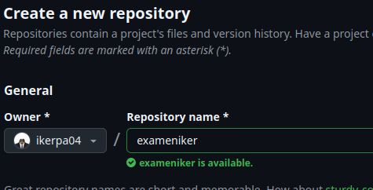

## MKDOCS
Creamos un directorio para mkdocs/repositorio.

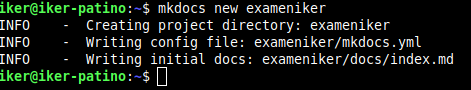

Ahora iniciamos el repositorio.

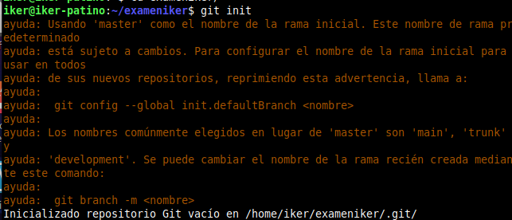

A continuación, subimos todo a github.

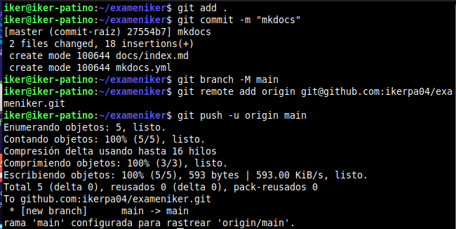

Verificamos.

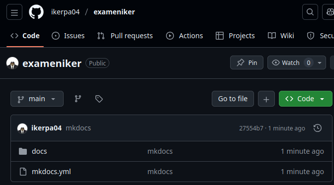

## Clonamos el repsotirio de la profesora
Clonamos el repositorio.

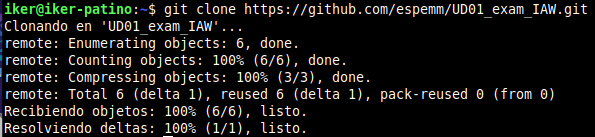

Copiamos el md de la profesora a nuestro repositorio.

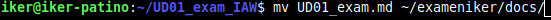

## Ramas
Creamos una nueva rama en nuestro repositorio y cambiamos a ella.

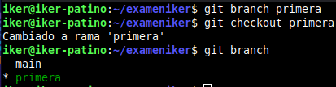

## Páginas
Modificaremos la pagina principal con nuestros datos.

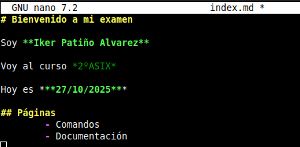

En el archivo YML pondremos la navegación a las diferentes páginas.

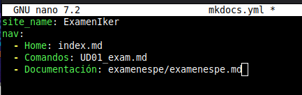

Subimos todo a github.

Subimos lo que hemos hecho a mkdocs

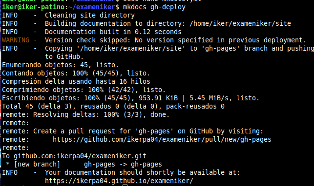
